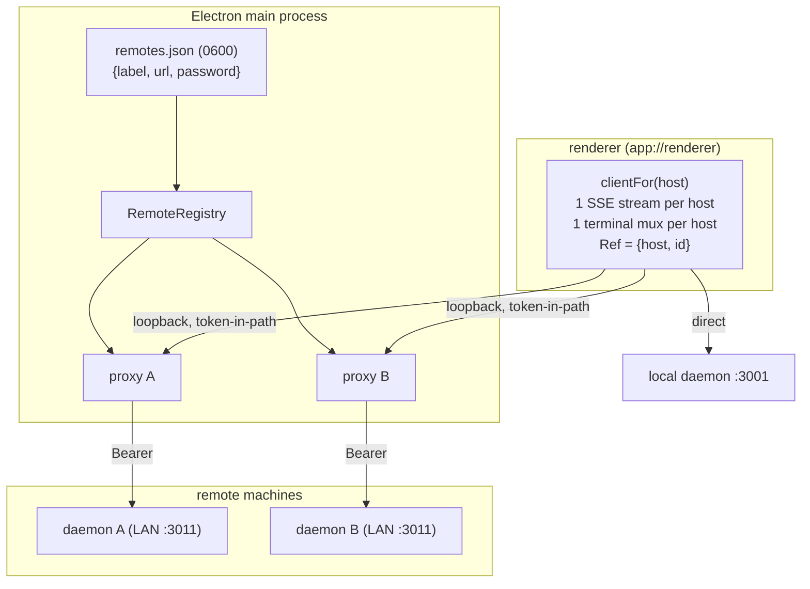

# EDD: Remote Sessions (Multi-Host Federation)

### Authors

- *(fill in)*

### Mandatory Approvers

- *(fill in — suggest: desktop/frontend owner)*
- *(fill in — suggest: security reviewer, for the LAN credential + loopback proxy model)*

### Reviewers

- *(business context)*
- *(technical domain — daemon/HTTP API owner)*
- *(manager)*
- *(platform stand-in — see note: no shared infrastructure is involved)*
- *(data stand-in — see note: no warehouse or BI impact)*

### Stakeholders

- *(fill in)*

---

# Objectives

Let one AO desktop app operate agent sessions on **several machines at once**.

**What:** the app connects to N AO daemons concurrently — the local one plus any saved
remote hosts — and presents every host's projects and sessions in a single tree. A session
can be opened, watched live, and typed into on any connected host without switching the app
into a "remote mode."

**Why:** agents are long-running and machine-bound. Work is spread across a laptop, a Mac
mini, and similar boxes, and before this the only options were SSH-ing to each machine or
pointing the whole app at one host at a time. Users could not see or compare work across
machines, and every cross-machine action meant a context switch.

**Who:** individual engineers running AO on more than one machine they own, on a trusted
network. Not multi-tenant, not multi-user.

**When:** shipped to `develop` 2026-08-14 (PRs #64–#87), verified working across two real
machines.

**Where:** entirely client-side — the Electron desktop app. No backend/daemon changes were
required for the client half.

## Goals

1. **Concurrent multi-host view.** Every connected host's projects and sessions in one tree,
each remote row labelled with its host.
2. **Act in place.** Open a remote project or session without a reload, a mode switch, or a
change to where any other action is sent.
3. **Live, not polled.** Each host gets its own event stream, so remote boards and
conversations update in real time.
4. **Interactive remote terminals.** A live terminal on each host simultaneously.
5. **Unambiguous targeting.** Every write names the machine it acts on, and destructive
prompts state the host. A session id existing on two hosts must never be confusable.
6. **Credential containment.** The connection password never enters the renderer process.
7. **Zero regression for single-host users.** With no saved hosts, behaviour is identical to
before.

## Non-Goals

- **SSH transport.** The original UI reference implied SSH hosts. AO's model is an AO daemon
over HTTP with a connection password; SSH would be a new transport, a new credential path,
and remote process supervision. Deliberately deferred (see Alternatives).
- **Daemon-to-daemon federation.** The local daemon does not connect to peers. Federation is
renderer-side only.
- **Multi-user or shared hosts.** One operator, machines they own. No per-user ACLs, no
concurrent-operator conflict resolution.
- **WAN / internet exposure.** LAN or Tailscale only. No TLS, no cert pinning, no NAT
traversal.
- **Global identity.** Project and session ids stay per-host. Ids are qualified at the
addressing boundary, never rewritten.
- **Browser-client host management.** The daemon-served web UI is already *at* one daemon by
URL; it degrades to local-only and cannot manage hosts.
- **Remote host management of the local machine.** Out of scope by symmetry.

---

# Background

**AO** is an Electron desktop app that supervises long-running coding-agent sessions. The app
owns a local **daemon** (a Go HTTP server on `127.0.0.1:3001`) that holds the project
registry, spawns sessions, streams events over SSE, and serves terminals over a WebSocket
multiplexer (`/mux`). The renderer is a React app whose origin is `app://renderer`.

Three things shipped before this work and are load-bearing here:

1. **A LAN listener** (default `:3011`), enabled per host, gated by an 8-character
**connection password**. It has per-source-address lockout against guessing
(`backend/internal/httpd/auth.go`). Loopback is ambient authority; LAN is
credential-gated.
2. **A CLI remote target** — `ao <cmd> --url http://host:3011`, authenticating with
`Authorization: Bearer <connection password>`, with saved hosts in **`~/.ao/remotes.json`**
(mode 0600, refused if looser).
3. **A `-url` correctness audit** (PRs #56–#63) that fixed nine cases where a command
accepted `-url` and acted on the wrong machine anyway.

**What reviewers need to know to review this effectively:**

- **The renderer cannot authenticate to a remote daemon by itself.** `EventSource` and
browser `WebSocket` cannot set an `Authorization` header, and `app://renderer` has no CORS
standing with a daemon that never allow-listed it. This single constraint determines the
entire design.
- **Project ids collide by construction.** The daemon derives a project id as
`strings.ToLower(filepath.Base(path))`, so `~/dev/agent-orchestrator` is
`agent-orchestrator` on *every* machine. Any design that resolves a bare id against a
merged multi-host list will target the wrong machine — this is the default case, not an
edge case.
- **This is a local desktop application.** Several sections of this template assume a
server-side SaaS with HTTP endpoints, a data warehouse, and shared infrastructure. Those
are marked **N/A** below with the reason, rather than filled with invented content.

---

# Design Details

## Overview

**Renderer-side fan-out with a per-host authenticated loopback proxy.**

**Components**

| Component | File | Responsibility |
| --- | --- | --- |
| Host identity | `renderer/lib/hosts.ts` | `HostId`, `Ref = {host,id}`, `refKey`/`parseRefKey` |
| Saved-host store | `main/remotes-store.ts` | read/write `~/.ao/remotes.json`, enforce 0600 |
| Authenticated request | `main/remote-request.ts` | Bearer-injected fetch; `probeRemote` health |
| Loopback proxy | `main/remote-proxy.ts` | per-host HTTP + WebSocket proxy, token-gated |
| Proxy registry | `main/remote-registry.ts` | N live proxies keyed by URL; lifecycle |
| Per-host clients | `renderer/lib/host-clients.ts` | `clientFor(host)`, connect/disconnect, base map |
| Fan-out query | `renderer/hooks/useWorkspaceQuery.ts` | one query per host, `["workspaces", host]` |
| Per-host streams | `renderer/lib/host-events.ts` | one `EventSource` per host, host-scoped invalidation |
| Per-host terminals | `renderer/lib/terminal-mux.ts` | mux pool keyed by host |
| UI | `Sidebar`, `HostSelect`, `AddRemoteHostDialog`, `RemoteFolderPicker` | one tree, labels, filter, add/edit/remove |

**Key mechanisms**

1. **Local is a host.** `LOCAL_HOST` is a `HostId` like any other — the one whose requests
skip the proxy. No code path special-cases "is this remote?".
2. **Everything addressable is a `Ref`.** Ids are never rewritten; they are qualified only
where an action is routed. Every mutation takes a `Ref` and dispatches via
`clientFor(ref.host)`, so targeting the wrong machine is a type error rather than a
runtime accident. Routes are host-qualified (`/host/$hostId/session/$sessionId`,
`/host/$hostId/project/$projectId`) so a reload or restored window reopens the same
session on the same machine.
3. **The proxy solves the header problem.** Electron main is not a browser: it can set
`Authorization` and is not subject to CORS. The renderer talks to
`http://127.0.0.1:<ephemeral>/<128-bit token>` and the proxy forwards upstream with the
Bearer credential, stripping the token so the remote daemon and its logs never see it.
The token lives **in the URL path** — the one place `EventSource` and `WebSocket` can both
carry a credential. The proxy answers CORS preflight locally for `app://renderer`.
4. **Streams and terminals follow hosts.** One SSE connection per host, each tagged so an
event from host B invalidates only `["workspaces", B]`. The terminal mux pool is keyed by
host, and the mux URL is derived from that host's base — preserving the path prefix, which
is what carries the token.
5. **Failure is data, not an exception.** Each host carries `ready | checking | failed`. A
failed host renders as a labelled section with a retry and never blanks the tree or
discards another host's data. Hosts connect **after** first paint, so an unreachable or
sleeping host cannot block startup; probes are bounded at **5s**
(`AbortSignal.timeout`, `main/remote-request.ts`).
6. **Credential containment.** Only `{label, url}` and the loopback proxy base ever cross to
the renderer. Enforced by test.

## Rollout Plan

This is a **desktop application**, not a service: rollout is an app release, and there is no
server-side deploy, no traffic shifting, and no possibility of a partial-fleet outage.

**Safety properties that make this low-risk:**

- **Additive and opt-in.** With no entries in `~/.ao/remotes.json`, `connectedHosts()` is
empty, the app behaves exactly as before, and the entire remote path is inert. Existing
single-host users are unaffected by default.
- **No daemon change required.** The client half needs no new server endpoints, so a new app
can talk to older daemons. (One exception below.)
- **Backward compatible with older remote daemons.** Version skew is permanent and expected:
`GET /api/v1/fs/dirs` (remote folder browsing) exists only on daemons at or after PR #66.
Against an older host the picker reports *"That host did not return a folder listing. It may
be running an older build without folder browsing"* and the rest of the feature works.
Users can still register a project by absolute path.

**Stages:**

1. **Internal dogfood — complete.** Verified across two real machines on a LAN: both hosts'
projects in one labelled tree, a remote project opened in place, and live terminals on both
machines simultaneously.
2. **Release with the feature discoverable but unconfigured.** Users must add a host
deliberately (Add project → Host → Add remote host), which requires physically reading a
connection password off the other machine's Settings → Connect Mobile.
3. **Documentation** of the trust boundary — see Security & Privacy. This should not ship as
a silent capability.

**Rollback:** ship the previous app build. There is no migration and no persisted schema
change beyond `remotes.json`, which the CLI already used and which older builds still read.

## Trade Offs

| Decision | Why | Cost accepted |
| --- | --- | --- |
| **Renderer-side fan-out**, not a daemon hub | No daemon-to-daemon link; peer credentials stay in the app rather than behind a loopback socket that every local process can reach; merging logic sits where the UI's needs are visible | Every query, id and write in the renderer became host-aware — a wide (if shallow) refactor |
| **Loopback proxy** rather than header injection or CORS negotiation | `EventSource`/`WebSocket` cannot set headers; Electron `webRequest` header-mangling fights Chromium's CORS enforcement | A local listener per connected host; token-in-path complexity |
| **Token in the URL path** | The only place both stream transports can carry a credential | Tokens can leak via logs if ever printed; mitigated by stripping before forward and never logging paths |
| **Ids qualified, not rewritten** | A project keeps the same id in its own daemon, CLI and URLs; no translation layer | Composite keys (`refKey`) everywhere ids are used as map keys or React keys |
| **One host at a time was rejected** | The explicit product requirement was to work across machines without switching | Concurrency: N streams, N proxies, partial-connectivity states as a normal case |
| **Failure as per-host data** | With N hosts, "two fine, one asleep" is the normal state | Consumers must read per-host status; a regression here (#78) shipped and had to be fixed in #86 |
| **Hosts connect after first paint** | An unreachable host must never block startup | Consumers had to learn hosts arrive asynchronously; getting this wrong silently disabled live updates |

---

# Alternatives Considered

1. **Hub federation in the local daemon.** The local daemon connects to peer daemons and
re-exposes their state as its own; the renderer stays a single-daemon client and the
header problem disappears. **Rejected:** it moves peer connection passwords into the daemon,
which loopback clients reach with ambient authority — meaning any local process could
transitively reach the whole fleet. It also puts UI-shaped merging decisions in Go, and
introduces the first daemon-to-daemon link in the system. Revisit if multi-host becomes a
server-side concern (e.g. headless orchestration).
2. **Switch-to-open (one active host at a time).** Simpler: pick a host, the app reloads
pointed at it. This was actually shipped as an interim state and **rejected on use** — it
makes cross-machine comparison impossible and forces a reload per switch, which is exactly
the workflow the feature exists to remove.
3. **SSH transport.** Matches the original UI reference and would remove the plaintext-LAN
password entirely (auth by existing SSH keys, no exposed listener on the remote). **Deferred,
not rejected** — and now cheap: an SSH entry becomes `ssh -N -L` from main to the remote
daemon's loopback port, then the identical proxy path. The proxy is the seam.
4. **Browser-only remote access** (the existing Phase 1). Already shipped and retained: point a
browser at `http://<host>:3011/`. **Insufficient** — one host per tab, no cross-machine view,
and no desktop integration.
5. **Global id namespacing** (rewrite ids to `host:id` everywhere). **Rejected:** it breaks
parity with each daemon's own CLI and URLs, and the collision problem only needs solving at
the addressing boundary.

---

# Dependencies

**Technologies:** Electron main process (`node:http`, `node:net`, `node:crypto` — **no new
runtime dependencies were added**), React 19, TanStack Query/Router, `openapi-fetch`, Vitest,
Playwright.

**Internal services:** the AO daemon's existing `/api/v1` HTTP surface, its SSE stream
(`/api/v1/events`), and its terminal multiplexer (`/mux`). One new daemon endpoint was added
for remote folder browsing: **`GET /api/v1/fs/dirs`** (read-only, directory names only, no
file contents, dotfiles skipped, capped at 500 entries), declared in the code-first OpenAPI
spec and therefore covered by the existing `api-drift` CI check.

**External services / SaaS:** **none.** No new vendor relationship, so **the Vendr process is
not triggered** and there is nothing for IT/Security/Legal/Finance to onboard. All traffic is
between machines the user already owns, on their own network.

**Data pipeline:** **N/A.** This feature adds no tables or columns and removes none; it does
not write to any warehouse. See Data and Business Intelligence.

**HTTP latency guidance (<250ms) and background workers:** the `<250ms` endpoint target and
the "use non-HTTP Convox workers for long jobs" guidance apply to server-side request
handling and are **not applicable** — this feature adds no server endpoints. The one new
daemon endpoint (`fs/dirs`) is a bounded single-directory `readdir`, capped, with no
serialization of large collections. Long-running work in AO already runs as supervised agent
processes, not inside HTTP requests.

---

# Performance & Scalability

**What the complexity is proportional to: the number of *saved hosts*, which is human-scale
(typically 1–3, realistically never more than ~10).** It is *not* proportional to request
throughput, row counts, or user population — there is one operator per app instance.

Per connected host, steady state:

| Resource | Cost |
| --- | --- |
| Loopback proxy | 1 listener on `127.0.0.1`, ephemeral port, in the main process |
| REST | 1 workspace query per host per refresh (`/projects` + `/sessions`) |
| SSE | 1 long-lived `EventSource` |
| Terminals | 1 mux WebSocket per host *with an open terminal* |

**How this impacts existing endpoints and workflows:**

- **Local daemon: unchanged.** Local requests still go direct, not through a proxy. A user
with no saved hosts issues exactly the same traffic as before.
- **Remote daemons: each sees a single additional client.** The load a remote daemon
experiences is one more operator, which is the load it was designed for.
- **Renderer:** fan-out multiplies request *count* by the number of hosts, not by data volume.
Queries are per-host (`["workspaces", host]`) and run in parallel via `Promise.allSettled`;
one slow host cannot serialize the others.
- **Proxy overhead** is a loopback hop with header rewriting and `pipe()` streaming — no
buffering of response bodies, so SSE chunks and terminal frames are forwarded as they
arrive (pinned by test).

**Bounded failure costs:**

- Host probes are capped at **5s** (`AbortSignal.timeout`), so an unreachable host cannot hang
startup or a reconnect indefinitely.
- Hosts connect **after first paint**, so startup latency is independent of host count and
reachability.
- A host whose stream drops falls back to the existing polling interval rather than going
stale silently — though see Metrics for a gap here.

**Scaling limits and what to do:** the design degrades linearly with host count. If host
counts ever grew beyond a handful (not an anticipated use case), the fixes would be lazy
connection (connect on first use rather than at boot) and shared-connection pooling. Neither
is warranted now.

---

# Metrics & Monitoring

**Shipped (AO-78).** This section was the weakest part of the implementation — the remote
path had no telemetry and no logging at all, so "I expected my remote session to update and
it didn't — why?" was unanswerable from anywhere. The instrumentation below is now in place.

**Instrumentation:**

| Signal | Why | Where |
| --- | --- | --- |
| `ao.renderer.host_connect` (result: online/unauthorized/offline/not-a-daemon, duration, source: add/edit/probe) | Is adding a host succeeding, and which failure mode dominates? | `renderer/lib/host-telemetry.ts`, emitted from the add/edit dialog and the saved-host probe |
| `ao.renderer.host_stream_state` (host, connected/disconnected, reconnect count) | Detect the silent no-live-updates case | `renderer/lib/host-events.ts`, on each state transition |
| `ao.renderer.host_query_failed` (host, status) | Per-host data failures, previously invisible — remote clients are plain `openapi-fetch` clients and bypass `api-client`'s `ao.renderer.api_error` | `renderer/hooks/useWorkspaceQuery.ts`, in `fetchHostSection` |
| Proxy lifecycle logs in main (start/stop, upstream error, 502) — **never the token or password** | Debuggability for "the app can't reach my host" | `main/remote-proxy.ts` |
| `hostConnectionState` surfaced in the UI | The user is the fastest detector | Sidebar host notice: "Not receiving live updates from {host}", carried on `HostSection.streamState` |

**Alerting/pages:** **N/A** — this is a locally-installed desktop app with no on-call
surface. Detection is user-facing and telemetry is aggregate/diagnostic, not paging.

**No-secrets rules, enforced by tests:**

- The connection password is never logged, never sent to the renderer, and never crosses to
the remote daemon in the URL (the proxy token is stripped before forwarding). All three
were true before this work and remain true.
- `main/remote-proxy.ts` logs the upstream address and the *post-strip* request path only.
It must never log `req.url` — its first segment IS the proxy token — nor `entry.password`.
- A host id IS a LAN address, so no `ao.renderer.host_*` event carries one. `host_id` is
hashed to `host_id_hash` by `sanitizeRendererProperties`, exactly as project ids are, and
`host_kind` (`local`/`remote`) is the only host attribute sent in the clear. Every other
property is dropped by the allowlist.
- `ao.renderer.host_query_failed` sends a status, never the daemon's error text, which can
carry paths.

**Volume control:** `captureRendererEvent`'s per-name rate limit is shared across hosts, so
`host_query_failed` additionally collapses repeats of the same (host, status) inside a
five-minute window — a host that is simply switched off refetches every 15 seconds forever
and would otherwise spend the whole daily ceiling and hide the next host to break.
`host_stream_state` fires on transitions only, because `EventSource` calls `onerror`
repeatedly while it retries.

**Two states, not one:** `hostConnectionState` distinguishes `idle` (no stream was ever
opened — jsdom, preview surfaces) from `disconnected` (a stream that dropped). Only the
second one means the board went stale, and only it is reported or shown.

**Cost:** small — one existing telemetry helper and a handful of `console` calls. No new
infrastructure, no new vendor, no storage cost beyond existing telemetry volume.

---

# Infrastructure & Networking

- **New infrastructure: none.** No servers, no cloud resources, no managed services. The only
new listeners are ephemeral loopback HTTP proxies inside the user's own Electron process,
bound explicitly to `127.0.0.1`.
- **Modified infrastructure: none.** The daemon's LAN listener already existed.
- **Cost:** **$0.** No CSP/EISP/RI cost-control mechanisms apply — there is no cloud spend.
- **Communication:** the app talks to (a) its own local daemon over loopback, and (b) each
saved remote daemon's LAN listener over the user's own network. No third-party endpoints.
- **Networking prerequisites the user must satisfy:** the remote host's LAN bridge must be
enabled, and the two machines must be mutually reachable (same LAN, or a Tailscale tailnet
via the existing `"bind": "tailscale"` option).
- **Known platform caveat:** on macOS, **Local Network privacy** must be granted to the
terminal/app or LAN connections fail with `EHOSTUNREACH`, which surfaces as a misleading
"no route to host". Apple-signed binaries like `curl` are exempt, which makes the diagnosis
confusing. This should be documented in setup instructions.

---

# Data

- **Relationship to existing data models:** none. This feature reads existing per-daemon
data (projects, sessions) and does not create a new model. Each daemon remains the sole
owner of its own records; there is no cross-host join, replication, or merged store. The
sessions→projects join is performed strictly **within** a single host's response set.
- **Impact on KPIs:** none — no warehouse or product-analytics model is touched.
- **New persisted data:** one file, **`~/.ao/remotes.json`**, which already existed for the
CLI: `{label, url, password}` per host, mode **0600**, refused if group/other-readable. This
feature adds UI to create, edit and remove entries; the format and permission rule are
unchanged.
- **Lifecycle:** entries live until the user deletes them. Removing a host in the UI deletes
its entry and tears down its proxy. There is no server-side copy and nothing to expire.
- **Storage cost:** negligible — a small local JSON file.
- **PII:** none beyond machine labels the user chooses and a per-host connection password
(see Security).

---

# Reliability

**Dependent-service outages are the normal case here**, not an exception, and the design
treats them that way.

| Failure | Behaviour |
| --- | --- |
| A remote host is asleep/unreachable | Its section renders as `failed` with a retry. Other hosts and local are unaffected; the tree is never blanked. Probes bounded at 5s. |
| A remote host is unreachable **at startup** | Boot completes regardless — hosts connect after first paint, so startup does not depend on remote reachability. |
| A remote host's password was rotated | The host reports `unauthorized` distinctly from `offline` — "wrong password" and "could not reach" are never conflated. The user edits the saved host in place. |
| A saved URL points at something that is **not a daemon** (e.g. a mistyped port hitting a dev server that 200s everything) | Rejected at add time and at connect time by validating `/healthz` through the daemon probe, not by status code alone. Prevents a bad entry from bricking the app on every launch. |
| A remote returns a **malformed body** (HTML from a wrong-port server, or valid JSON of the wrong shape) | Validated at the parse boundary; that host fails with an honest message. Never throws into the renderer. |
| Local daemon fails while remotes are healthy | Local is an app-level error and lights up the existing error paths; remote sections keep working. |
| A single bad input | Cannot bring the app down: response bodies are validated before reaching state, and per-host failures are isolated. |

**Recovery:** all failure states are user-recoverable in-app — retry a host, edit its
credential, or remove it. No process restart is required. If a saved host cannot be
activated at boot, the app degrades to local rather than failing to start.

**Residual risk:** the silent case — a host connected but its event stream not established —
degrades to polling with no indicator. See Metrics; this is the main reliability gap.

---

# Security & Privacy

**This is the section most deserving of scrutiny, and the trust boundary should be stated
explicitly in user-facing documentation.**

**Threat model / intended trust boundary:** a single operator, machines they own, on a network
they trust (home/office LAN, or a Tailscale tailnet). It is **not** designed for hostile
networks, shared machines, or multi-tenant use.

**Security review:** the daemon's LAN listener and origin policy were reviewed when Phase 1
shipped. **The client-side additions here — the loopback proxy and its token — have not had a
formal security review and should get one before this is promoted beyond internal use.**

**Attack surface and mitigations:**

| Surface | Risk | Mitigation |
| --- | --- | --- |
| LAN listener (`:3011`) | Plaintext HTTP, 8-character connection password, binds all interfaces by default | Per-source-address **lockout** on repeated failures (`auth.go`); `"bind": "tailscale"` or a specific IP narrows exposure; documented as trusted-network-only |
| **Loopback proxy** (new) | A local listener that forwards to a *different machine* with a stored credential — i.e. ambient authority for other local processes, the same model as AO's own loopback daemon | Every request must carry a **128-bit random token** in the URL path; without it the proxy 404s and forwards nothing. This limits reach to processes that can read renderer memory rather than any local process. Proxy is bound to `127.0.0.1` only, and is torn down when the host is disconnected. |
| Token leakage | A path-borne credential can leak via logs or referrers | Token is **stripped before forwarding**, so the remote daemon and its logs never see it; the proxy emits no logs at all today; tokens are per-activation, not persisted |
| Stored credentials | `~/.ao/remotes.json` holds plaintext passwords | Enforced mode **0600**; the file is *refused* if group/other-readable; the password **never enters the renderer process** (only `{label, url}` and the loopback base cross the IPC boundary, enforced by test). No OS keychain is used — a known limitation. |
| Remote filesystem listing (`fs/dirs`) | Reveals directory names on the remote host | Read-only, **directory names only** (no contents, sizes, or mtimes), dotfiles skipped, capped at 500 entries, and behind the same credential that already authorizes spawning agents (i.e. shell access) — so it is not an escalation |
| CORS / origin | `app://renderer` has no standing with a remote daemon | The proxy answers preflight locally and strips the renderer origin before forwarding; the daemon's strict origin policy is untouched |
| Wrong-machine actions | A destructive action landing on the wrong host | Every write takes a `Ref = {host,id}` routed via that host's client; destructive prompts name the host; a colliding-id test asserts the local daemon receives **no request** when a remote action fires |

**AuthN/AuthZ added:** yes — the app now presents a per-host bearer credential on the user's
behalf and validates hosts before trusting them. There is no per-user authorization model;
possession of the connection password is full authority on that daemon (as it already was for
the CLI).

**Cryptography:** `crypto.randomBytes(16)` for the proxy token. No encryption in transit on
the LAN path — **plaintext HTTP** — which is the single largest security limitation and the
reason the trust boundary is a trusted network. Tailscale is the recommended mitigation;
TLS with TOFU pinning is the longer-term fix.

**Data logged:** nothing in the remote path today (see Metrics). Any future logging must
exclude the password and the token.

**PII deletion:** no PII is collected or transmitted by this feature. Removing a host deletes
its stored entry; there is no server-side copy to purge.

---

# Vendors

**N/A.** No vendors are used, added, or affected. No SaaS relationship, no budget impact, no
SSO integration, and nothing requiring vendor security review. All communication is
machine-to-machine on infrastructure the user already owns.

---

# Accessibility

The feature has UI and should meet WCAG AA, consistent with the rest of the app.

**Addressed in the implementation:**

- **Host status is conveyed as text, not colour alone** ("Connected", "Connecting…",
"Disconnected", "Wrong password") — an explicit requirement during implementation.
- **Pending state uses a live region** (`role="status"`) rather than a spinner only, because
a multi-second host probe otherwise reads as a dead dialog to a screen-reader user.
- **Errors use `role="alert"`** and clear when the user retypes, so a stale error never sits
over corrected input.
- Unreachable hosts are **disabled** in the picker rather than selectable-then-failing.

**Audited (AO-80).** A keyboard and screen-reader pass over the host tree, filter, add/edit
dialogs and folder picker found and fixed:

- **The host picker's row actions were unreachable by keyboard.** Connect, Edit and Remove
sat inside a Radix `Select`, which calls `preventDefault()` on Tab within its listbox and
moves focus only between options — so they were mouse-only, and a listbox whose children are
buttons is not a listbox a screen reader can report faithfully. The picker is now a popover of
plain buttons: every action is a Tab stop and announces as itself. An unreachable host is
`aria-disabled` rather than `disabled`, so it stays focusable and its status can still be read.
- **The add/edit dialog could only be submitted by pointing at its button.** Its fields are now
a real `form`, so Enter saves, and the absolutely-positioned close button moved after the
fields in source order so opening no longer lands on Close.
- **The folder picker lost focus on every hop.** Stepping into a folder replaces every row, so
the focused row stopped existing. Focus now moves into the new listing, the path is a live
region, and a pending listing announces instead of leaving the dialog looking dead.
- **Duplicate accessible names.** Each unreachable host section had a button called just
"Retry"; each is now named for its host, as the picker's actions already were.
- **The host filter's effect was silent.** Changing it redraws the tree behind it, which a
screen reader has no reason to revisit; a live region now states which host is in view.

**Deliberately deferred:** the sidebar tree's own disclosure semantics (a project row carries
`aria-expanded` while its primary action navigates, with a second invisible toggle over the
folder icon owning the same state, and no `aria-controls` linking either to the session list).
That structure predates remote hosts and is shared with every local project, so it belongs to a
sidebar-wide pass rather than this one. Per-host grouping in the tree is also deferred: each
project's accessible name already carries its host via `hosts.qualified`, and there is no
visual host boundary for a `role="group"` to mirror.

---

# Business Intelligence

**N/A.** This feature touches no data model consumed by business intelligence. No Periscope
dashboards or Redshift views reference it, none need updating, and no existing metric
definition changes. If host-connection telemetry is added (see Metrics), it would be new
product-analytics events rather than a change to any existing model.

---

# Libraries

- **No new runtime dependencies** were added — the proxy uses Node built-ins (`node:http`,
`node:net`, `node:crypto`) already available in the Electron main process.
- **Java libraries: N/A** — no Java in this stack.
- **Internal contract change:** the daemon gained `GET /api/v1/fs/dirs`, declared in the
code-first OpenAPI spec (`apispec/specgen`). The generated TypeScript client
(`frontend/src/api/schema.ts`) is regenerated by `npm run api` and drift is enforced by the
existing `api-drift` CI job, so client/server contract skew is caught automatically.
- **Cross-build compatibility:** because a newer app may talk to an older daemon, the client
must tolerate missing endpoints. This is handled explicitly for `fs/dirs` and is a standing
requirement for any future endpoint.

---

# Deliverables

## Shipped (merged to `develop`, 2026-08-14, tip `1a36693db`)

| Area | PRs |
| --- | --- |
| `--url` correctness audit (nine items) | #56, #57, #58, #60, #61, #62, #63 |
| Saved-host store, authenticated requests, password-free IPC | #64 |
| Host picker UI (select, add-host dialog, live status) | #65 |
| Daemon `GET /api/v1/fs/dirs` + OpenAPI | #66 |
| Loopback proxy + activation IPC | #67 |
| Host selection in Add-a-project | #68 |
| Remote folder browsing UI | #69 |
| Host switcher, gated rebind, host-named prompts | #70 |
| Response-body validation at the parse boundary | #71 |
| Edit/remove a saved host | #72 |
| Reject a host that answers but is not a daemon | #73 |
| Federation: refs, N proxies, per-host clients | #74, #75, #76 |
| Federation: fan-out queries, per-host SSE, per-host terminals | #78, #79, #81, #83 |
| Proxy URL-prefix fix (token drop) | #80 |
| Quit-deadlock fix (upgraded-socket teardown) | #77 |
| Ref-routed writes, no global active host | #84 |
| One tree across every connected host | #85 |
| Local workspace failure visibility | #86 |
| Hostile fake daemon test harness | #87 |

**Verification performed:** full unit/component suite (~2,400 tests), typecheck and e2e
typecheck, Playwright smoke serially, `go test` + `go test -race`, `golangci-lint`, and CI
across ubuntu/macos/windows. Three independent multi-agent design reviews on the
highest-risk PR. **End-to-end verified on two real machines**, including simultaneous live
terminals.

## Remaining / recommended follow-up

| Item | Size | Priority | Parallelizable |
| --- | --- | --- | --- |
| ~~**Telemetry + proxy logging** (Metrics section) and surfacing `hostConnectionState` in the UI~~ — **done (AO-78)**, see Metrics & Monitoring | S–M | — | — |
| **Security review** of the loopback proxy + token model | S | **High** before promoting beyond internal use | Yes |
| **Accessibility audit** of the host tree, filter, and folder picker | S | Medium | Yes |
| **Setup documentation**: trust boundary, Tailscale, macOS Local Network privacy caveat | S | Medium | Yes |
| **SSH host support** — `ssh -L` tunnel into the existing proxy seam; removes plaintext LAN password entirely | M | Medium | No (after the above) |
| **TLS + TOFU pinning** for the LAN listener | L | Low (Tailscale covers the need) | No |
| Cross-platform verification (Windows/Linux daemon as a remote host) | M | Medium | Yes |

### Tasks

*Testing time is included in each estimate. The first four items are mutually independent and
can be parallelized across owners; SSH and TLS should follow the security review.*

1. ~~Instrument the remote path (host connect result/duration, stream state, per-host query
failure); add proxy lifecycle logging in main with an explicit no-secrets rule; surface
stream state in the UI.~~ **Done — AO-78.**
2. Security review of the loopback proxy, token handling, and `remotes.json` custody;
decide whether OS keychain storage replaces the 0600 file.
3. Accessibility pass (screen reader + keyboard) on the host tree, filter, add/edit dialogs
and folder picker.
4. User-facing setup documentation, including the trusted-network boundary, the Tailscale
bind option, and the macOS Local Network privacy failure mode.
5. SSH transport spike behind the existing proxy seam.
6. Cross-platform host verification.
