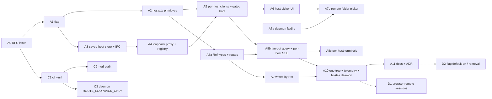

# Upstreaming remote session management

**Status:** plan, not started. No PR has been opened against upstream and none may be until
the human owner says go (§5).

**Target:** `Untrivial-ai/agent-orchestrator` `main` (public; squash-merges; upstream's
`AGENTS.md`/`CONTRIBUTING.md` govern). **Source:** our `develop`. Everything below was
verified against `origin/develop @ 13d9ee627` and `upstream/main @ 3cf4df384` on 2026-08-23.

## 0. What changed the plan while inventorying it

Four findings, each verified, that a naive "cherry-pick #41–#107 in order" would have missed:

1. **Upstream already has three open PRs and an issue in this exact space, none reviewed.**
   Issue [#3853] (2026-08-11, SSH remote workspaces) → PR [#3883] (+3176/−27, 32 files,
   `CONFLICTING`, 0 reviews); PR [#4084] `feat/headless-remote-daemon` (+3761/−39, 57 files,
   draft, `CONFLICTING`, 0 reviews — includes its *own* `frontend/src/main/remote-proxy.ts`);
   PR [#4309] `feat(webui): serve the LAN web UI with browser sessions` (+3182/−62, 30 files,
   opened 2026-08-23, 0 reviews — the same problem our fork PR #43 solved, with a different
   cookie design). Three 3k-line remote PRs sitting unreviewed is the strongest possible
   evidence that the stack must be small pieces, and that an RFC must precede code so we are
   not the fourth.
2. **The desktop multi-host feature needs no daemon change.** Upstream's LAN listener is
   `lanControlBlock(authMiddleware(handler))`; our loopback proxy strips the renderer
   `Origin` and injects `Authorization: Bearer`, and upstream's `corsMiddleware` passes any
   request with no `Origin`. So Track A (below) runs against an unmodified upstream daemon.
   The only daemon addition is the optional `GET /api/v1/fs/dirs` folder browser, which the
   client already degrades without.
3. **Our Phase 1 daemon work (#42/#43/#44/#57 — strict origin policy, `ao_conn` cookie
   login, `hostGuard`, embedded web UI, `bind` mode) is a *browser-client* track**, not a
   prerequisite of multi-host — and it collides head-on with [#4309]. It is parked (Track B).
4. **Upstream's own feature-flag idiom exists and is identical in our tree:**
   `developerMode` in `frontend/src/renderer/stores/ui-store.ts` (localStorage
   `ao.developerMode`, `setDeveloperMode`), the switch at
   `frontend/src/renderer/components/settings/GeneralSettingsSection.tsx:176`, consumers gating
   on it (`SessionInspector.tsx:279`, `settings/UpdatesSection.tsx:45`). The flag PR (A1)
   copies that pattern line for line. Note the switch lives in `GeneralSettingsSection.tsx`,
   which `GlobalSettingsForm.tsx` composes — not in `GlobalSettingsForm.tsx` itself.

## 1. Scope inventory

### 1.1 How `develop` is shaped

`git log origin/main..origin/develop`: 208 commits (165 non-merge, 43 merge). Merge-base with
`upstream/main` is `d4ae9b318` (2026-08-22). Fork-carried diff from that base: 416 files,
+37,272/−7,541. By area:

| Area | Files | Δ | Remote-session share |
| --- | --- | --- | --- |
| `frontend/src/renderer` | 178 | +12,934/−5,086 | Majority — the `Ref` threading (#84 alone touched 149 files) |
| `backend/internal/httpd` | 33 | +3,210/−87 | Mostly Track B (cors/auth/lan_listener/webui); `fs.go` is Track A |
| `packages/mobile` | 30 | +3,538/−1,504 | Out of scope (mobile multi-node #34) |
| `backend/internal/cli` | 25 | +2,570/−112 | Track C (`--url`) almost entirely |
| `frontend/src/main` + `main.ts` + `preload.ts` | 23 | +2,793/−267 | ~60% remote; rest is daemon-owner/browser-runtime/devtools |
| `docs` | 16 | +6,264 | EDD + plans; only the EDD and landing docs ship |
| `scripts`, `skills`, `.github`, `.claude`, `FEREADME.md` | 16 | +1,300 | Fork infra, none ships |

### 1.2 In scope — genuinely remote-session management

Grouped by the track they belong to upstream. Fork PR numbers are `AronPerez/agent-orchestrator`.

**Track A — desktop multi-host (Electron main + renderer).** Fork PRs #64–#87, #104, #105,
#106, #95, #112; EDD #101; docs #102, #111.

| Fork PR | What | Files (non-test) |
| --- | --- | --- |
| #74, #76 | Host identity primitives, per-host clients | `renderer/lib/hosts.ts` (30 lines), `renderer/lib/host-clients.ts` |
| #64, #73, #105 | Saved-host store (0600), authenticated request, password-free IPC, not-a-daemon rejection, AO-79 security fixes | `main/remotes-store.ts`, `main/remote-request.ts`, `main/remotes-ipc.ts`, `preload.ts` (`remotes` surface, lines 529–565), `main.ts` handlers (lines 1960–2040) |
| #67, #77, #80, #105 | Loopback proxy, registry, upgrade teardown, URL-prefix fix, https upstream | `main/remote-proxy.ts` (214 lines), `main/remote-registry.ts` (62 lines) |
| #75 | N hosts connected at once | `main/remote-registry.ts`, `renderer/lib/active-host.ts` (`initHosts`), `renderer/main.tsx:97` |
| #65, #72, #106 | Host picker UI, add/edit/remove dialog, a11y pass | `components/HostSelect.tsx`, `AddRemoteHostDialog.tsx`, `hooks/useRemoteHosts.ts`, i18n `hosts.*` (51 keys × 8 locales) |
| #66 | **Daemon:** `GET /api/v1/fs/dirs` | `controllers/fs.go` (86 lines), `dto.go` (+35), `specgen/build.go`, `openapi.yaml`, `frontend/src/api/schema.ts` |
| #68, #69 | Host choice in Add-a-project, remote folder picker | `CreateProjectFlow.tsx`, `RemoteFolderPicker.tsx` |
| #71 | Response-body validation at the parse boundary | `renderer/lib/response-validation.ts` |
| #78, #81, #79, #83 | Fan-out workspace query, per-host SSE, per-host terminal mux | `hooks/useWorkspaceQuery.ts` (263 vs 148 upstream), `lib/host-events.ts`, `lib/event-transport.ts`, `lib/terminal-mux.ts`, `types/workspace.ts`, routes `_shell.*` |
| #84 | Every write routed by `Ref`; host-qualified routes `/host/$hostId/…` | 149 files: 53 components, 23 lib, 21 hooks, 9 routes, 16 e2e specs, `e2e/support/fake-bridge.ts` |
| #70, #85, #86 | Host switcher, one tree across hosts, failure sections, local-failure visibility | `Sidebar.tsx`, `HostSwitcher.tsx`, `ShellTopbar.tsx`, `SessionsBoard.tsx` |
| #104 | Telemetry + proxy lifecycle logs (no-secrets rules) | `lib/host-telemetry.ts`, `lib/host-disclosure.ts`, `remote-proxy.ts` |
| #87 | Hostile fake daemon test harness | tests only |
| #95 | Usage query on the session's own host | `SessionInspector.tsx`, `useSessionUsage` |
| #101, #102, #111 | EDD, landing docs (`remote-sessions.mdx`, `remote-access.mdx`, troubleshooting), SSH recipe | `docs/remote-sessions-edd.md`, `frontend/src/landing/content/docs/configuration/*` |

**Track C — CLI remote target (Go only, independent of A).** Fork PRs #41 (minus its
web-UI bits), #50, #52, #56, #58, #60, #61, #63; daemon helpers #62, #49.

| Fork PR | What | Files |
| --- | --- | --- |
| #41 | `--url`/`AO_URL`, `~/.ao/remotes.json` lookup, Bearer | `cli/remote.go` (376 lines), `client.go`, `root.go`, `status.go`, `stop.go`, `config/config.go`, `docs/cli/README.md` |
| #50, #56, #58, #61, #63 | Nine-item `--url` correctness audit (commands that silently acted locally) | `project.go`, `spawn.go`, `doctor.go`, `preview.go`, `import.go`, `start.go`, `hooks.go`, `agent_process.go`, `browser.go` |
| #52, #60 | Remote path judged by remote host's rules; destructive prompts name the daemon | `remote.go`, `session.go`, `pr_ref.go` |
| #62 | Daemon: `404 ROUTE_LOOPBACK_ONLY` distinguishes a LAN policy block from a missing route | `lan_listener.go` (small hunk) |
| #49 | Daemon: build skew detectable on the authenticated wire | `daemonmeta/` (193 lines), `doctor.go` — optional |

**Track B — browser client (parked, see §1.3 and §4).** Fork PRs #31, #33, #42, #43, #44,
#57, and the `AGENTS.md` hard-rules paragraph they added.

**Adjacent, later:** #99 browser remote sessions (`/browser-runtime` bridge so a remote
worker's `ao browser` drives the desktop app's Browser panel). Depends on Track A's registry
(`main.ts:1994`, `connectBrowserRuntime` per remote) and is outside `/api/v1`; ship after A10.

### 1.3 Entangled but out of scope

| What | Why it stays in the fork | Where it touches in-scope code |
| --- | --- | --- |
| **Track B** — strict origin policy (`requiresStrictOrigin`, `hostGuard`), `POST /api/v1/auth/login` + `ao_conn` session cookie, `Sec-WebSocket-Protocol` bearer, embedded web UI bundle (`httpd/webui`, `webUIBypass`), `bind` mode (`all`/`tailscale`/IP), `daemon-build.sh` webui step, `build-daemon.mjs` gate | Not needed by A or C (verified: the proxy's Bearer path satisfies upstream's unmodified LAN listener). Collides with upstream [#4309], which is 0-reviewed and newer. Pushing ours now produces two competing 3k-line PRs. | `cors.go`, `auth.go`, `lan_listener.go` (shares a file with C's #62 hunk), `AGENTS.md`, `scripts/daemon-build.sh`, `frontend/vite.renderer.config.ts`, `main.ts` (`AO_ALLOWED_ORIGINS` handling) |
| Mobile multi-node (#34), mobile CORS/subprotocol (#31, #33), Expo background scripts (#22–#27) | `packages/mobile` is a separate client; upstream's mobile is evolving independently (their #3707 Tailscale pairing) | `auth.go` `wsProtocolToken` (Track B file) |
| Daemon-owned lifecycle: app spawns/replaces the daemon, per-launch token, `daemon-owner.ts` | Fork-local operational decision (2026-08-08) | `main.ts` — the bulk of its +624 |
| Persistent browser profiles + `ao doctor` build-skew (#90), browser type fixes (#46/#47), devtools fallback (#119), tmux options (#48), cleanup facts (#51/#53/#54), chat checkpoint (#113), nested-agent guard (#116), stale-exit liveness (#118), board find bar (#120), CI superseded-cancel (#121) | Unrelated fork work | none |
| Fork infra: `scripts/ao-svc`, `install-desktop-app.sh`, `dev-setup.sh`, `install-hooks.sh`, `mobile-web-server.sh`, `scripts/README.md`, `skills/*`, `.github/workflows/upstream-sync.yml`, `.claude/skills/bug-triage` edits, `FEREADME.md`, `docs/superpowers/*`, `docs/plans/*`, pre-commit hook changes (#55, #96) | Our machines, our workflow | none |

### 1.4 Entanglement hazards — where a cherry-pick must be by hunk, not by file

- **`frontend/src/main.ts`** (+624/−163): remote wiring is ~130 lines (imports 36–52, the
  `registry`/IPC block 1960–2040, the per-remote `connectBrowserRuntime` at 1085+ and 1994+).
  The rest is daemon-owner, devtools, browser-runtime. Extract the remote hunks into a new
  `main/remotes-main.ts` (one `registerRemotesIpc(ipcMain, registry)` call from `main.ts`) so
  the upstream diff to `main.ts` is ~10 lines and never conflicts with their churn.
- **`frontend/src/preload.ts`** (+232/−63): only the `remotes` surface (lines 529–565) and
  `hasRemote` ship. Same treatment.
- **`useWorkspaceQuery.ts`**: upstream 148 lines, ours 263. Ship as a rewrite PR (A8b), not a
  patch; reviewers need the whole file anyway.
- **`lan_listener.go`**: Track C's #62 hunk (`ROUTE_LOOPBACK_ONLY`) and Track B's webui bypass
  live in the same function. Cherry-pick #62 alone; it is ~20 lines.
- **`AGENTS.md`**: the fork-added hard-rules paragraph describes Track B invariants
  (`hostGuard`, `TestEveryLANRouteIsCredentialGated`, `webUIBypass`). It must **not** ride
  along with Track A; A11 adds its own two-sentence rule about the proxy instead.
- **e2e `support/fake-bridge.ts`** needs a `remotes` stub the moment `preload.ts` gains the
  surface, or every smoke spec throws on `aoBridge.remotes.list`. Ship the stub in A3.
- **Upstream is 16 commits ahead of our `main` mirror** (`#4228` telemetry org, `#4270`
  display status, `#4248` composer redesign…). Every Track A PR branches from `upstream/main`,
  never from `develop` — the fork's `main` mirror is only a reference.

## 2. The PR stack

### 2.1 Ground rules, from how upstream actually merges

Observed on `upstream/main` (last 25 merged PRs, 2026-08-21…23): **squash-merge**, one
single-parent commit per PR titled `type(scope): …` `(#N)`; typical size 2–16 files, the
largest recently merged was 45 files / +1,691 (a UI polish pass); an external-contributor
triage bot assigns an on-call review pair the same day; the PR
template is What/Why/How/Testing/Checklist; CI gates are `go` (build/vet/`test -race`/lint),
`api-drift` (`npm run api` must produce no diff in `openapi.yaml` + `schema.ts`), `frontend`
(typecheck, typecheck:e2e, vitest), `renderer-smoke` (Playwright). There is no prettier/biome
config upstream, so formatting is whatever the file already has (tabs in `.ts/.tsx`).

Rules for this stack:

1. **Branch every PR from `upstream/main`.** Open PR *n+1* only after PR *n* is squash-merged
   and rebased onto; do not open a six-deep chain of stacked PRs against a squash-merging
   repo (each merge turns the children's ancestry into phantom conflicts —
   `rebase --onto`, never merge `main` in).
2. **Every PR is dark behind the flag** (A1) so every PR is independently mergeable and
   reviewable as "zero behaviour change with the flag off". That is the whole argument for
   reviewing 15k lines in pieces.
3. **≤ 15 non-test files, ≤ ~600 non-test lines** per PR, except the two mechanical `Ref`
   PRs (A8a, A9), which are large but trivially reviewable (every site gets `LOCAL_HOST`).
4. **Tests ride with the code they pin** — the fork already has a falsifying test per
   security finding; they go in the same PR as the fix they guard.
5. **Strip fork-isms before opening** (§3.3): Linear ids, fork PR numbers, EDD template
   sections.

### 2.2 The feature flag (answers the four questions asked)

**Name and scope.** `remoteHosts: boolean` in `ui-store.ts`, persisted at localStorage key
`ao.remoteHosts`, with `setRemoteHosts`, exactly mirroring `developerMode` /
`ao.developerMode` / `setDeveloperMode` (`ui-store.ts:58,127,138,157,185`). **Renderer-only,
like `developerMode`.** The daemon and CLI need no gate:

- The daemon's only Track A change (`fs/dirs`) is additive, credential-gated on the LAN
  listener, and ambient-authority on loopback like every other project-registration route.
- The CLI's `--url` is opt-in per invocation by construction; a flag would be a second
  opt-in for the same thing.
- **The main process never initiates a remote connection.** Verified: `registry.connect` is
  called only from the `remotes:connect` IPC handler (`main.ts:2023`); there is no boot-time
  read of `remotes.json` in main. The only boot-time connector is `initHosts()` in
  `renderer/lib/active-host.ts`, called once from `renderer/main.tsx:97`. So gating the
  renderer gates the sockets.

**Off-state: no connections at all, not connected-but-hidden.** With `remoteHosts === false`:
`initHosts()` returns without calling `aoBridge.remotes.list()`; `connectedHosts()` is
`[LOCAL_HOST]`; no proxy is started, no probe is sent, no `EventSource` beyond the local one
is opened; `HostSelect`, `HostSwitcher`, the sidebar host filter and host sections are not
rendered. Saved entries in `~/.ao/remotes.json` are left untouched (the CLI still uses them).
Toggling **on** calls `initHosts()`; toggling **off** calls `disconnectHost` for every
connected remote so the invariant "flag off ⇒ zero remote sockets" holds without a restart.
(Connected-but-hidden was rejected: it makes the off-state unverifiable from the network
side, which is the one property a reviewer most wants to check.)

**Default off. Surface: a sibling switch, not nested under Developer Mode.** A new
`SettingsRow` labelled *Remote hosts (experimental)* directly below the Developer Mode row in
`GeneralSettingsSection.tsx:176`, with `settings.remoteHosts` / `settings.remoteHosts.hint`
i18n keys in all eight locales. Sibling, because the audience is a user with two machines,
not a developer; nesting would also double the off-state test matrix. If maintainers prefer
experimental features hidden under Developer Mode, it is a one-line change to the render
condition (§4, Q3) — the store shape does not change.

**Reviewer-verifiable off-state, and the tests that pin it (all land in A1/A5):**

| With the flag off a reviewer can check… | Pinned by |
| --- | --- |
| Settings modal shows one new row; nothing else in the UI differs | `GeneralSettingsSection.test.tsx` snapshot-free assertion on the row + `GlobalSettingsForm.test.tsx` pattern at line 149/183 |
| `initHosts()` never touches the bridge | `active-host.test.ts`: `remotes.list` spy not called when `remoteHosts` is false |
| `connectedHosts()` is exactly `[LOCAL_HOST]` | `host-clients.test.ts` |
| Startup network = local daemon only | e2e smoke (`smoke-t0.spec.ts`) with `fake-bridge` recording every `remotes:*` invocation: assert zero |
| Toggling off tears down proxies | `active-host.test.ts`: `remotes.disconnect` called once per connected host |
| Main opens no socket without an IPC call | `remote-registry.test.ts`: registry constructed, no `connect` → no listener (already true; add the assertion) |

### 2.3 Dependency graph



Two tracks run in parallel: **A** (desktop, TypeScript) and **C** (CLI, Go) share only
the `remotes.json` format and reviewers. A7a (Go) can go any time after A0.

### 2.4 Track A — desktop multi-host

Each entry: **scope · files · why it stands alone · tests · review risk · blocks.**

**A0 — RFC issue (no code).** One upstream issue: problem, the renderer-side-fan-out design
(three paragraphs + the component table from the EDD), the trust boundary, the flag, the
PR list below with sizes, and an explicit relationship to [#3853]/[#3883]/[#4084]/[#4309]
(§4). Ask for a maintainer to own review. *Stands alone:* it is the thing that makes the rest
welcome. *Blocks:* everything — do not open A1 until a maintainer has reacted.

**A1 — `feat(settings): add an experimental Remote hosts flag`.**
Scope: §2.2. Files: `ui-store.ts`, `settings/GeneralSettingsSection.tsx`, 8 × `i18n/*.json`,
`GeneralSettingsSection.test.tsx`. ~60 lines. *Stands alone:* nothing reads the flag yet; the
only visible change is one switch that persists a boolean. *Tests:* default false, persists
to `ao.remoteHosts`, survives reload. *Risk:* nil — the maintainers wrote this pattern.
*Blocks:* A5 (first consumer).

**A2 — `feat(hosts): host identity primitives`.**
Files: `renderer/lib/hosts.ts` (30 lines), `hosts.test.ts`. `HostId`, `Ref`, `LOCAL_HOST`,
`isLocal`, `refKey`/`parseRefKey`. *Stands alone:* a pure module with no importer. *Tests:*
round-trip keys with `:` and `%` in both halves. *Risk:* naming only — maintainers may want
`Ref` called something less generic; settle it here, cheaply, before 149 files use it.
*Blocks:* A5, A8a.

**A3 — `feat(remotes): saved-host store, authenticated requests, password-free IPC`.**
Fork #64 + #73 + AO-79 findings #1 and #4 from #105. Files: `main/remotes-store.ts` (94),
`main/remote-request.ts` (86), `main/remotes-ipc.ts` (58), new `main/remotes-main.ts`
(the IPC handlers extracted from `main.ts:1960–1992`: list/add/update/remove/probe/request),
`preload.ts` `remotes` surface minus connect/disconnect/connected, `e2e/support/fake-bridge.ts`
stub. ~420 lines + tests. *Stands alone:* no renderer caller; main only
answers IPC it is never sent. *Tests* (all exist in the fork): 0600 enforced and refused if
looser, win32 exemption, `@`-userinfo redirect refused (High #1), `/healthz`-validated probe
rejects a non-daemon, `{label,url}` only crosses IPC — the password never does. *Risk:*
**security review** — credential custody. Say in the PR body that the format is shared
verbatim with C1 and why no OS keychain (EDD "Decision: keep the 0600 file"). *Blocks:* A4.

**A4 — `feat(remotes): token-gated loopback proxy for remote daemons`.**
Fork #67 + #77 + #80 + AO-79 #2/#3 from #105. Files: `main/remote-proxy.ts` (214),
`main/remote-registry.ts` (62), `remotes-main.ts` connect/disconnect/connected handlers,
`preload.ts` the three remaining calls. ~330 lines + 392 lines of tests. *Stands alone:*
still no renderer caller. *Tests* (exist): 128-bit token required else 404 and nothing
forwarded; token stripped before forward; `Origin` stripped; preflight answered locally;
SSE/WS streamed via `pipe()` not buffered; upgraded socket torn down on disconnect (#77);
URL path prefix preserved (#80); https upstream uses TLS (#105 High #2); never logs
`req.url`. *Risk:* **highest in the stack** — a local listener that forwards a stored
credential to another machine. This is the PR to request an explicit security reviewer on,
and to link the EDD's accepted-risks list. It is also where upstream's [#4084] has its own
proxy; reconcile in A0 first. *Blocks:* A5.

**A5 — `feat(hosts): per-host API clients and flag-gated host boot`.**
Fork #75/#76 + the flag wiring. Files: `renderer/lib/host-clients.ts`, `lib/active-host.ts`
(`initHosts` gated on `remoteHosts`; toggle-off disconnects), `renderer/main.tsx` (one call),
`lib/response-validation.ts` (#71, 13-file PR in the fork; here it is one module + its
tests), `ui-store.ts` subscribe-on-toggle. ~250 lines. *Stands alone:* the first PR where the
flag does something, and with it off the app is byte-for-byte the same. With it on and no
saved hosts, `initHosts` resolves an empty list. *Tests:* the off-state table in §2.2;
`clientFor(LOCAL_HOST)` is uncached and follows the daemon base; malformed remote bodies fail
that host, never throw. *Risk:* low. *Blocks:* A6, A8b.

**A6 — `feat(hosts): add, edit and remove remote hosts`.**
Fork #65 + #72 + #106 (a11y). Files: `hooks/useRemoteHosts.ts`, `components/HostSelect.tsx`,
`AddRemoteHostDialog.tsx`, `HostSwitcher.tsx`, i18n `hosts.*` (51 keys × 8), one mount point
in `CreateProjectFlow.tsx` behind the flag. ~700 lines — the upper bound; split add/edit from
remove if asked. *Stands alone:* UI for data A3 already manages. *Tests* (exist):
`HostSelect.test.tsx`, `AddRemoteHostDialog.test.tsx`, `CreateProjectFlowHosts.test.tsx`;
status conveyed as text not colour; `role="status"` during a probe; `role="alert"` clears on
retype; every row action is a Tab stop. *Risk:* UI review against upstream's design system
(`packages/product-ui`); expect copy and layout notes, not architecture. *Blocks:* A7b.

**A7a — `feat(daemon): read-only directory listing at GET /api/v1/fs/dirs`.** Fork #66. Go
only. Files: `controllers/fs.go` (86), `dto.go` (+35), `specgen/build.go`, `openapi.yaml`,
`frontend/src/api/schema.ts` (regenerated — `api-drift` gate), `fs_test.go`. *Stands alone:*
additive endpoint; directory names only, dotfiles skipped, 500 cap. *Tests* (exist): cap,
dotfiles, non-directory, absent path, LAN credential-gated. *Risk:* "is this an escalation?"
— answer in the body: it sits behind the same credential that already authorises spawning a
shell. *Blocks:* A7b.

**A7b — `feat(projects): register a project on a remote host, browsing its folders`.** Fork
#68 + #69. Files: `CreateProjectFlow.tsx`, `RemoteFolderPicker.tsx`, `hooks/useRemoteHosts.ts`
(host choice), `lib/daemon-error.ts`, i18n. *Stands alone:* gated on the
flag and on a remote host being selected. *Tests* (exist): older-daemon degradation message;
focus moves into the new listing; path is a live region. *Risk:* low.

**A8a — `refactor(hosts): thread Ref and host-qualified routes through reads`.** The
mechanical half of #74/#78/#84: `types/workspace.ts` gains `host`, routes become
`/host/$hostId/session/$sessionId` and `/host/$hostId/project/$projectId` with the old paths
redirecting, every read site passes `LOCAL_HOST`. Large (≈60 files) but every hunk is the
same shape. *Stands alone:* with one host, `LOCAL_HOST` everywhere is an identity
transformation; routes redirect so deep links survive. *Tests:* existing suites unchanged +
route redirect test. *Risk:* merge conflicts with upstream renderer churn — open it the day
after A5 merges and land it within 48h; coordinate a quiet window in A0. *Blocks:* A8b, A9.

**A8b — `feat(hosts): fan out workspace queries and event streams per host`.** Fork #78,
#81, #79 minus the mechanical parts. Files: `hooks/useWorkspaceQuery.ts` (rewrite, 263
lines), `lib/host-events.ts`, `lib/event-transport.ts`, `_shell.tsx`. *Stands alone:* with
the flag off the host list is `[LOCAL_HOST]` and the fan-out is a loop of one; query keys
change from `["workspaces"]` to `["workspaces", host]` — the one thing a reviewer should look
for in every invalidation site. *Tests* (exist): one `EventSource` per host; an event from B
invalidates only `["workspaces", B]`; `Promise.allSettled` so one slow host cannot serialise
the rest; #81 regression (queries registered per host). *Risk:* the silent-failure class the
fork hit twice (#78 → #86, #81). *Blocks:* A8c, A10.

**A8c — `feat(hosts): one terminal mux per host`.** Fork #83. Files: `lib/terminal-mux.ts`,
`hooks/useShellTerminals.ts`, `TerminalPane.tsx`. *Stands alone:* pool keyed by host; mux URL
derived from the host's base (which carries the token prefix). *Tests* (exist): mux URL keeps
the prefix; two hosts, two sockets. *Risk:* low, but it is the path users notice first.

**A9 — `refactor(hosts): route every write by Ref`.** The write half of #84, split by area
into 2–3 PRs if > 60 files each: sessions/terminals; projects/orchestrator; PRs/reviews.
Every mutation takes a `Ref` and dispatches via `clientFor(ref.host)`; destructive prompts
name the host. *Stands alone:* with one host it is an identity transformation. *Tests*: the
colliding-id test from the fork — a remote action against project id `agent-orchestrator`
sends **no request** to the local daemon (the default case, not an edge case: ids are
`filepath.Base(path)` on every machine). *Risk:* conflicts, as A8a. *Blocks:* A10.

**A10 — `feat(hosts): one tree across every connected host`.** Fork #85 + #86 + #70's
sidebar peek + #104 telemetry + #87 hostile fake daemon + #95. Files: `Sidebar.tsx`,
`SessionsBoard.tsx`, `ShellTopbar.tsx`, `lib/host-telemetry.ts`, `lib/host-disclosure.ts`,
`useWorkspaceQuery.ts` (`fetchHostSection`), `SessionInspector.tsx`. *Stands alone:* the
user-visible feature, first reachable end to end; still behind the flag. *Tests* (exist):
failed host renders as a labelled section with retry and never blanks the tree; local
failure visible (#86); `host_id` hashed, never sent in clear; `host_query_failed` collapsed
per (host,status) per 5 min; `host_stream_state` on transitions only; hostile daemon
(HTML body, wrong-shape JSON, 200-everything port) never throws into the renderer. *Risk:*
product review of the tree; telemetry allowlist review. *Blocks:* A11, D1.

**A11 — `docs(remote-hosts): setup, trust boundary, ADR`.** Fork #101 (EDD, rewritten as
`docs/adr/0003-remote-hosts-renderer-fanout.md` — upstream's ADR 0002 is taken, and
[#3883] also proposes an `0002`), #102 + #111 landing docs (`remote-sessions.mdx`,
`remote-access.mdx` additions, troubleshooting: macOS Local Network privacy, Tailscale, the
`ssh -N -L` recipe + `"bind": "127.0.0.1"`), a two-sentence `AGENTS.md` hard rule: *the
proxy binds `127.0.0.1` only, requires the per-activation token, strips it before forwarding,
never logs `req.url`*. *Stands alone:* docs. *Risk:* none.

**D1 (later) — `feat(browser): let a remote worker drive the desktop Browser panel`.** Fork
#99. Go `httpd/browser_runtime_bridge.go` + `browserruntime/broker.go`, `main/browser-runtime-link.ts`
changes, registry callback. After A10; needs its own small RFC paragraph.

**D2 (later) — flip the default / remove the flag.** After one release cycle with no
off-state regressions and at least one maintainer running two machines. The flag's removal
PR deletes one store field, one row, and the `initHosts` guard.

### 2.5 Track C — CLI remote target (Go, independent)

**C1 — `feat(cli): target a remote daemon with --url / AO_URL`.** Fork #41 without its
docs-web bits. Files: `cli/remote.go`, `client.go`, `root.go`, `status.go`, `stop.go`,
`config/config.go`, `docs/cli/README.md`; tests `remote_test.go` (738 lines). *Stands alone:*
flag absent ⇒ unchanged; `remotes.json` lookup only on `--url`. *Tests* (exist): scheme must be
http/https; userinfo refused; 0600 refused if looser (win32 exempt, mirrors A3); `AO_TOKEN`
precedence; `ao status --url` names the daemon. *Risk:* security (credential on the wire is
the existing LAN model); the maintainers' "CLI is a thin client" rule is satisfied — it is
still HTTP. Also the place to state that SSH entries are ignored, not rejected
(`lookupRemoteEntry` `continue`s past a bad URL). *Blocks:* C2, C3.

**C2 — `fix(cli): stop --url silently acting on the local machine`** — fork #50, #52, #56,
#58, #60, #61, #63 as **three** PRs: (i) refuse local-only commands with `--url` (`doctor`,
`preview`, `import`, `start`, `daemon`, `hooks`, `agent-process supervise`), (ii) judge
`--path` by the remote host's rules and stop local `gh`/path resolution, (iii) name the
daemon in destructive prompts and success lines. Each is table-tested in the existing
`*_test.go` style. *Risk:* low; each is a behaviour the maintainers would call a bug.

**C3 — `fix(daemon): distinguish a LAN policy block from a missing route`** — fork #62, the
~20-line `ROUTE_LOOPBACK_ONLY` hunk in `lan_listener.go` + test. Needed so `ao --url doctor`
can say "that route is loopback-only on the remote" instead of "404". *Optional follow-on:*
#49 build-skew on the authenticated wire (`daemonmeta`, 193 lines) — propose in A0, ship only
if wanted.

### 2.6 Track B — parked

Do not open. If maintainers merge [#4309], re-derive our browser client on top of it (our
`hostGuard`/DNS-rebinding test and `TestEveryLANRouteIsCredentialGated` are the parts worth
carrying over, as issues or small PRs against their design). If [#4309] stalls, propose ours
in the A0 thread as an alternative with the comparison already written (their cookie is
per-web-session with CSRF; ours is the existing `ao_conn` + strict `Sec-Fetch-Site`).

## 3. De-forking notes

### 3.1 Things that looked fork-local and are not

- **The `~/.ao` userData pin is upstream.** `upstream/main:frontend/src/main.ts:156` pins
  `userData` to `~/.ao/electron` (`~/.ao/dev/electron` unpackaged) and `AGENTS.md` carries the
  hard rule. Nothing to de-fork.
- **`CLAUDE.md`, `DESIGN.md`, `CONTEXT.md`, `CONTRIBUTING.md` are byte-identical to
  upstream** (`git diff upstream/main HEAD -- <file>` is empty for all four). The "clone
  agent-orchestrator verbatim" design banner is upstream's own text.
- **`README.md`'s only difference is upstream being ahead** (#4228 added the telemetry-org
  sentence after our merge-base), not fork drift.
- **`docs/adr/0001`, `0002` are upstream.** Ours would be `0003`.

### 3.2 Things that are fork-local and must not ship

| Fork-local | Why upstream would reject or be confused |
| --- | --- |
| `AGENTS.md` hard-rules paragraph (added by #42/#43/#45) | Describes Track B invariants that will not exist upstream; also 900 words where upstream's rules are one line each |
| `scripts/ao-svc`, `install-desktop-app.sh`, `dev-setup.sh`, `install-hooks.sh`, `mobile-web-server.sh`, `scripts/README.md`; the webui step in `daemon-build.sh` and `build-daemon.mjs` | Our launchd/codesign workflow; upstream's `scripts/` has `daemon-build.sh` + the e2e pod gate only |
| `skills/local-services`, `skills/machine-setup`, `skills/wrapping-launchd-services`; `.claude/skills/bug-triage` edits | Our agent tooling |
| `.github/workflows/upstream-sync.yml` | Fork-sync machinery |
| `FEREADME.md`, `docs/superpowers/**`, `docs/plans/**`, `docs/README.md`/`STATUS.md` edits | Fork planning artefacts; `docs/superpowers/plans/2026-07-08-mobile-web-terminal.md` contains `/Users/amongstar/…` paths and `2026-08-23-stale-exit-liveness.md` links a fork issue and a claude.ai artifact |
| `docs/remote-sessions-edd.md` as-is | It is an internal EDD template with Authors/Approvers/Vendr/BI sections marked N/A, Linear ids (AO-78/79/80/82), fork PR numbers, and a "shipped to develop 2026-08-14" rollout section. Rewrite as the ADR in A11 (design, trade-offs, security review findings + accepted risks, SSH spike conclusions). |
| Daemon-owned-by-app lifecycle, `AO_KEEP_DAEMON`, per-launch token | Not in scope; a separate conversation if ever |

### 3.3 Scrub list before any PR is opened

Verified clean today, re-verify on each branch: `grep -rnE "amongstar|AronPerez|/Users/|AO-[0-9]+|\(#[0-9]{2,3}\)|ponytail:"` over the PR's files returns nothing for every Track A/C
source and test file (it does today). Other scrub items:

- **No secrets, hostnames, or LAN addresses** exist in the in-scope code or tests; every
  fixture uses `127.0.0.1` and ephemeral ports; the hostile fake daemon is `httptest`-style.
  The EDD mentions a measured `/api/v1/mobile/status` leak with "value not recorded" — keep
  it that way.
- **Telemetry:** `host_id` is hashed by `sanitizeRendererProperties`; `host_kind` is the only
  clear-text host attribute; `host_query_failed` carries a status, never daemon error text.
  State this in A10's body — upstream's telemetry doc (`docs/telemetry.md`) should gain the
  three event names.
- **Commit trailers:** our commits carry `Co-Authored-By: Claude …` and `Claude-Session:`
  trailers. Upstream's recent history shows squash commits with the PR body only; trailers
  vanish on squash, so nothing to do, but do not paste session links into PR bodies.
- **Formatting:** upstream has no prettier/biome; match the surrounding file (tabs). Our
  fork dropped the prettier pre-commit check (#96) so nothing auto-reformats; run
  `npm run typecheck && npx vitest run` per PR and `go test -race ./...` + `golangci-lint`
  for Go.
- **i18n:** all eight locales (`de, en, es, fr, ja, ko, pt-BR, zh-CN`) must gain every
  `hosts.*` and `settings.remoteHosts*` key in the same PR, or the frontend typecheck fails.
- **The SSH spike test** (`remote-proxy.ssh-spike.test.ts`, on a fork branch only) shells
  out to a live `ssh` and is not merge material anywhere — it stays out.

### 3.4 Conventions upstream will push back on, and the answer to give

| Likely objection | Answer (already in the EDD; lift it into the PR body) |
| --- | --- |
| "Why not put federation in the daemon?" | It would move peer passwords behind a loopback socket every local process can reach, and create the first daemon-to-daemon link. Renderer-side keeps credentials in main and merging where the UI needs it. |
| "A new listener per host violates the one-network-bind rule" | The proxy binds `127.0.0.1` only, ephemeral port, token-gated, torn down on disconnect. It is not network-facing; the rule is about `0.0.0.0`. State it in `AGENTS.md` (A11). |
| "Plaintext password on the LAN" | Unchanged from the existing Connect Mobile model; Tailscale `bind` and the `ssh -N -L` recipe are the mitigations and are documented; https upstreams use TLS (AO-79 #2). |
| "Why a 0600 file and not `safeStorage`?" ([#4084] chose `safeStorage`) | Shared store with the Go CLI; `safeStorage` is macOS-only protection in practice and does not shrink the blast radius of a same-user attacker. Offer the keychain as a follow-up if they want the split. |
| "Ids are not globally unique" | Deliberate: `Ref = {host,id}` qualifies at the addressing boundary, keeps parity with each daemon's CLI/URLs; rewriting ids was considered and rejected. |
| "Too many files in A8a/A9" | Mechanical, flag-dark, identity with one host; offered split by area; request a 48h review window. |

## 4. Open questions for maintainers — and whether an RFC precedes code

**Yes, an issue first.** Not only because `CONTRIBUTING.md` says "non-trivial work? comment
on the issue or ping Discord first", but because there are already three unreviewed remote
PRs and one issue; a fourth unannounced 15k-line effort would be filed next to them and
ignored. The issue (A0) should be posted, the maintainers' reaction read, and only then A1
opened. Discord (daily sync, 10:00 PM IST) is the channel upstream names; use it for the
go/no-go, GitHub for the design thread.

Questions to put in A0, in priority order:

1. **Which remote model do you want?** Three are on the table: [#3883] one-active-workspace
   over SSH with the renderer unmodified; [#4084] one-active-remote over Tailscale HTTPS with
   an Electron proxy and `safeStorage`; ours — N hosts at once, `Ref`-addressed, loopback
   proxy, 0600 file shared with the CLI, SSH as a later transport behind the same proxy seam
   (spiked: zero proxy change). Ours is the only one verified on two real machines and the
   only one with a security review, but it is also the widest renderer change. If they want
   single-active-host, A8–A10 shrink dramatically and A1–A7 still apply. **This decides the
   back half of the stack.**
2. **Is a loopback proxy with a path-borne token acceptable as a standing mechanism?** It is
   the one piece of new attack surface. Alternatives (header injection via `webRequest`,
   CORS negotiation with the remote) were rejected for concrete reasons; ask them to agree
   before A4 rather than in A4.
3. **Flag placement:** sibling of Developer Mode (proposed) or nested under it? And do they
   want the flag named in the Feature Releases / developer vocabulary?
4. **`remotes.json` as the shared store** between CLI and app — accept the 0600 file, or
   require `safeStorage` for the app even at the cost of forking the store?
5. **`GET /api/v1/fs/dirs`** — acceptable as an authenticated read-only endpoint, or do they
   prefer absolute-path entry only (the client already degrades to it)?
6. **Host-qualified routes** `/host/$hostId/…` with redirects from the old paths — any
   objection to the URL shape, since it is user-visible and permanent?
7. **Relationship to [#4309]** (browser client): do they intend to merge it? If so we park
   Track B for good and contribute our rebinding/credential-gating tests to it.
8. **Review bandwidth:** will a maintainer own the stack for ~6 weeks, and can A8a/A9 get a
   quiet-window merge (they conflict with any renderer churn)?
9. **Telemetry:** three new renderer events (`host_connect`, `host_stream_state`,
   `host_query_failed`) — fine under the existing allowlist model?
10. **Windows/Linux as the remote** — nobody has verified it. Is that a blocker for merge or
    for default-on (D2)?

## 5. What this plan does not do

It opens nothing, pushes nothing, and comments nowhere on `Untrivial-ai/agent-orchestrator`.
Every outward action above — A0 through D2, and the Discord ping — needs an explicit go from
the human owner, one step at a time; approval for A0 is not approval for A1.

## Appendix — verification commands used

```bash
git fetch origin upstream
git rev-list --count origin/main..origin/develop                         # 208
git merge-base upstream/main origin/develop                              # d4ae9b318
git log --oneline --no-merges origin/main..origin/develop | grep -E '\(#[0-9]+\)'
git diff --numstat $(git merge-base upstream/main HEAD) HEAD             # fork-carried diff
for f in …; do git cat-file -e upstream/main:$f; done                    # which files exist upstream
git show upstream/main:backend/internal/httpd/{cors,auth,lan_listener}.go
gh pr list  --repo Untrivial-ai/agent-orchestrator --state merged --limit 25 …
gh pr view  3883 4084 4309 --repo Untrivial-ai/agent-orchestrator --json files,reviews,mergeable
gh issue view 3853 --repo Untrivial-ai/agent-orchestrator
grep -rn developerMode frontend/src                                       # flag idiom, paths
grep -rnE "amongstar|AronPerez|/Users/|AO-[0-9]+|ponytail:" <in-scope files>   # clean
```

[#3853]: https://github.com/Untrivial-ai/agent-orchestrator/issues/3853
[#3883]: https://github.com/Untrivial-ai/agent-orchestrator/pull/3883
[#4084]: https://github.com/Untrivial-ai/agent-orchestrator/pull/4084
[#4309]: https://github.com/Untrivial-ai/agent-orchestrator/pull/4309
